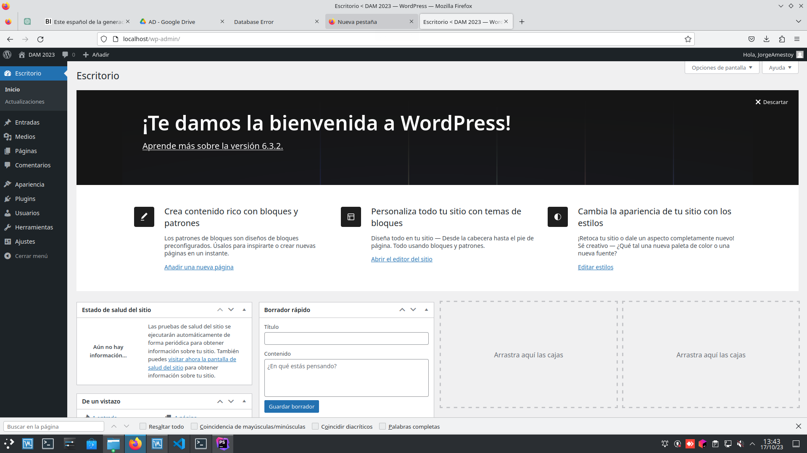

# TAREA WORDPRESS
### INFORMACIÓN SOBRE WORDPRESS
**WordPress** es un sistema de gestión de contenido de código abierto que se utiliza para crear y administrar sitios webs y blogs. 
Sin la nacesidad de conocimientos avanzados en dicha materia, se caracteriza por su fácil uso,
la personalización a la hora crear sitios webs y su seguridad.<br>
Para levantar un contenedor y ejecutar WordPress, puedes encontrar
una guía paso a paso de cómo realizarlo en [Docker Docs](https://docs.docker.com/samples/wordpress/).

### DOCKER.COMPOSE.YML
Como explica la guía, creas un fichero *.yml* en un editor de texto y escribes el código para definir
la configuración necesaria y ejecutar WordPress:
```
services:
  db:
    # We use a mariadb image which supports both amd64 & arm64 architecture
    image: mariadb:10.6.4-focal
    # If you really want to use MySQL, uncomment the following line
    #image: mysql:8.0.27
    command: '--default-authentication-plugin=mysql_native_password'
    volumes:
      - db_data:/var/lib/mysql
    environment:
      - MYSQL_ROOT_PASSWORD=somewordpress
      - MYSQL_DATABASE=wordpress
      - MYSQL_USER=wordpress
      - MYSQL_PASSWORD=wordpress
    expose:
      - 3306
      - 33060
  wordpress:
    image: wordpress:latest
    volumes:
      - wp_data:/var/www/html
    ports:
      - 80:80
    environment:
      - WORDPRESS_DB_HOST=db
      - WORDPRESS_DB_USER=wordpress
      - WORDPRESS_DB_PASSWORD=wordpress
      - WORDPRESS_DB_NAME=wordpress
volumes:
  db_data:
  wp_data:
````
**Servicios**: En este caso se definen, dos servicios:
- db: usando una imagen de la base de datos MariaDB, se crean variables de entorno, entre ellas, 
las credenciales de usuario, y se exponen los puertos
para que otros servicios accedan a esta.
- wordpress: usando la imagen más reciente de WordPress, se establecen
  las variables de entorno para poder conectarse.

**Volúmenes**: Se defines los volúmenes de ambos servicios para almacenar y asegurar
los datos de MySQL y los archivos de WordPress.

**Puertos**: Se consigue que el puerto 80 del sistema host se asocie al puerto 80
del contenedor de WordPress.

Finalmente, inicias los contenedores con el comando:
```
$ DOCKER-COMPOSE UP -D
```
Para comprobar que funciona correctamente, escribes la dirección IP 
o el dominio del servidor donde se está ejecutando Docker seguido del puerto 80:




